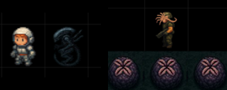
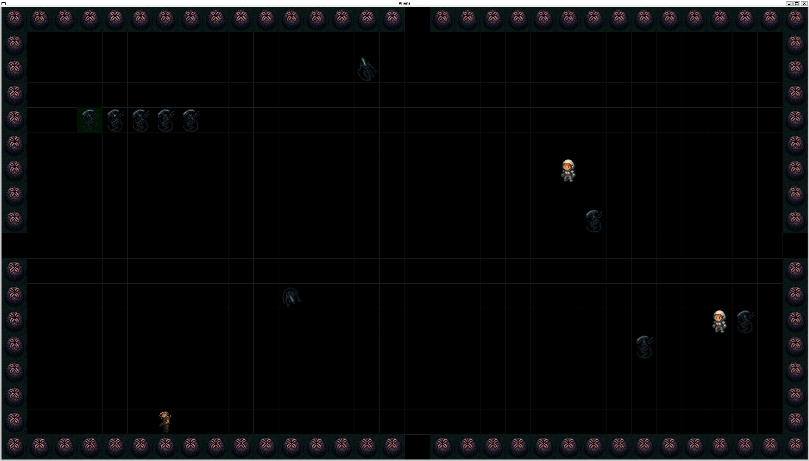

# Aliens
Boot.dev personal project.

Essentially a classic snake game with Alien(s) theme.



## Motivation

Too many snakes. It's time for xenomorphs.

## Quick Start
- Install python
- `source .venv/bin/activate`
- `python3 main.py`

## Usage
- Uses UV virtual environment (`source .venv/bin/activate`)
- Currently hard-coded to 3200 x 1800 window size
- Start with `python3 main.py`
- Controls: cursor keys
- For testing, use ENTER key to add one alien to your pack
- Adjust game parameters in `constants.py` (window size, arena tile size, player speed, alien params, NPC spawn rate, ...)

## Game Logic
- The player is a pack of xenomorphs (the snake equivalent)
- Humans are spawned from openings at the edge of the arena
- Consume a human to get faster
- If a human touches an alien egg at the edge of the arena, a face hugger will attach itself
- Infected humans turn into xenomorphs
- Bump into a xenomorph to add it to your pack (you grow)
- Most humans are civilians and can't harm you
- Some humans are colonial marines
- If a colonial marine gets too close, you lose one xenomorph (you shrink) and the marine dies
- The game ends if you collide with the wall, collide with yourself, or you have no xenomorphs left in your pack

## Future Work
- Right now the only goal of the game is to maximise the stats (time played, humans consumed, etc.)
- A final boss could be added as follows:
- Once the pack is big and fast enough, exit the area through one of the four openings
- This leads to a corridor with two sentry guns at the end
- At least one xenomorph has to make it past the guns to win the game

## Contributing

### Clone
```bash
git clone https://github.com/chris1010010/aliens@latest
cd aliens
```

### Submit a pull request

If you'd like to contribute, please fork the repository and open a pull request to the `main` branch.


